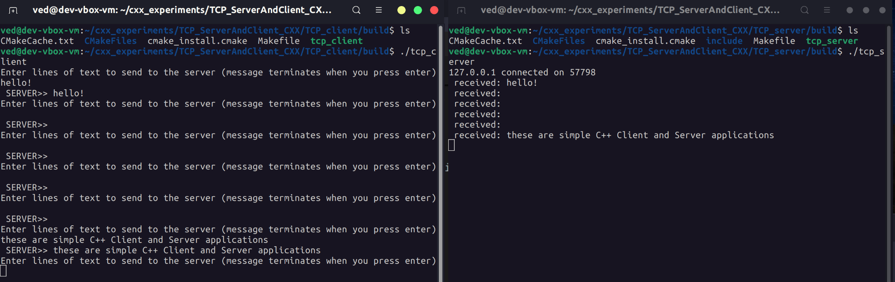

# TCP server and client in C++

Small CMake project: a TCP **server** and **client**, used as homework while at CAIR Bangalore, following Sloan Kelly’s YouTube network-programming material.

Notes: [docs/reports/network-programming-in-cxx-notes.pdf](docs/reports/network-programming-in-cxx-notes.pdf)

## Layout

| Path | Role |
| --- | --- |
| [`TCP_server/`](TCP_server/) | Server app |
| [`TCP_client/`](TCP_client/) | Client app |

Configure and build each app with CMake from its directory (or the CMakeLists you used originally).
